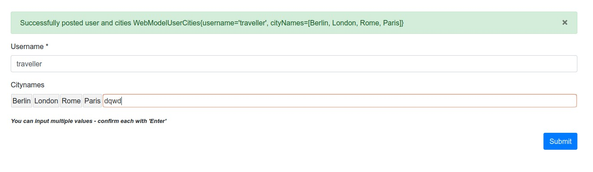

# simple-spring-boot-tag-inputfield
Just a demo on a simple tag input field inside a thymeleaf form posting a list of strings to the backend.

The idea and a main part of the work comes from this stackoverflow post:
https://stackoverflow.com/a/48138287/5885758

